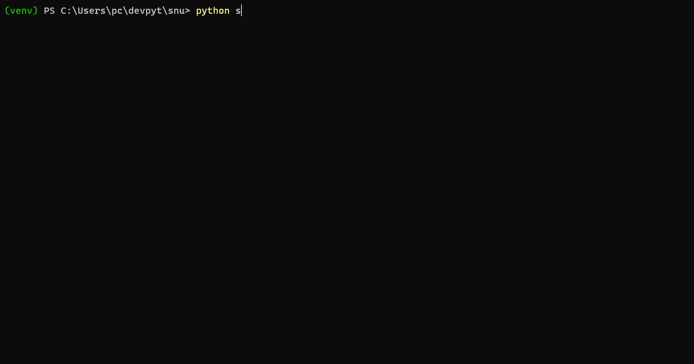

# SNU 🗄 Snipe-IT Utilities

Command-line interface (CLI) for [Snipe-IT (free open-source IT asset management)](https://snipeitapp.com/) extending with features team checkin and team checkout.

## Features

- Team checkin and checkout
- Efficient parallel asynchronous requests processing through [AIOHTTP](https://github.com/aio-libs/aiohttp)
- Modern user friendly CLI through [Rich](https://github.com/Textualize/rich) and [Typer](https://typer.tiangolo.com/)
- Command-line auto-completion



## Installation

- Fill parameters.py with your ***base_url (server URL)*** and ***Authorization header (API Key)***
- Install de the requirements:
```
python -m pip install "typer[all]" requests aiohttp
```

## ⚠️ Disclaimer of Warranty

THERE IS NO WARRANTY FOR THE PROGRAM, TO THE EXTENT PERMITTED BY APPLICABLE LAW. EXCEPT WHEN OTHERWISE STATED IN WRITING THE COPYRIGHT HOLDERS AND/OR OTHER PARTIES PROVIDE THE PROGRAM "AS IS" WITHOUT WARRANTY OF ANY KIND, EITHER EXPRESSED OR IMPLIED, INCLUDING, BUT NOT LIMITED TO, THE IMPLIED WARRANTIES OF MERCHANTABILITY AND FITNESS FOR A PARTICULAR PURPOSE. THE ENTIRE RISK AS TO THE QUALITY AND PERFORMANCE OF THE PROGRAM IS WITH YOU. SHOULD THE PROGRAM PROVE DEFECTIVE, YOU ASSUME THE COST OF ALL NECESSARY SERVICING, REPAIR OR CORRECTION.